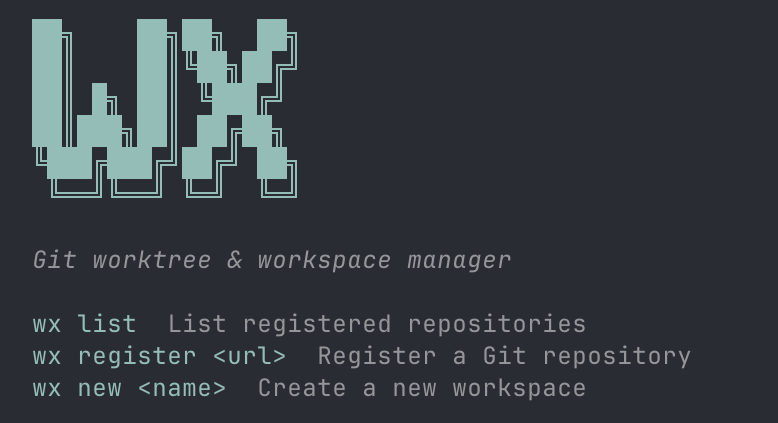

# wx

Git worktree と VSCode/Kiro workspace を統合管理する CLI ツール。

[English](README.md)

## 特徴

- 複数リポジトリを bare clone で一元管理
- worktree + workspace ファイルを自動生成
- 並列開発のセットアップを高速化



## インストール

### crates.io から

```bash
cargo install wx
```

### ソースから

```bash
git clone https://github.com/mzkmnk/wx.git
cd wx
cargo install --path .
```

## 使い方

### リポジトリを登録

```bash
wx register git@github.com:org/frontend.git
wx register git@github.com:org/backend.git
```

登録されたリポジトリは `~/.wx/` に bare clone されます。

### 登録済みリポジトリを確認

```bash
wx list
```

### ワークスペースを作成

```bash
cd ~/work
wx new feature-auth
```

対話形式でリポジトリとブランチを選択すると、`feature-auth/` ディレクトリが作成され、その中に worktree と `.code-workspace` ファイルが生成されます。

## データ保存先

```
~/.wx/
├── config.json        # 登録リポジトリ一覧
├── frontend.git/      # bare リポジトリ
└── backend.git/       # bare リポジトリ
```

## 開発

```bash
# ビルド
cargo build

# テスト
cargo test

# リリースビルド
cargo build --release
```

## License

MIT License - Copyright (c) mzkmnk <mzk.mnk.dev@gmail.com>
